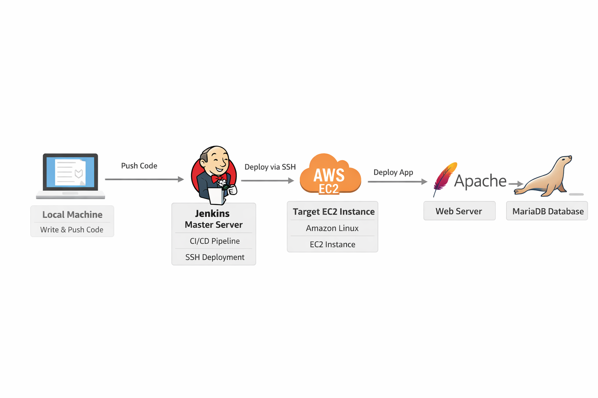
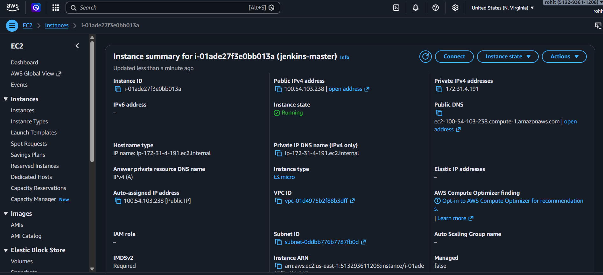
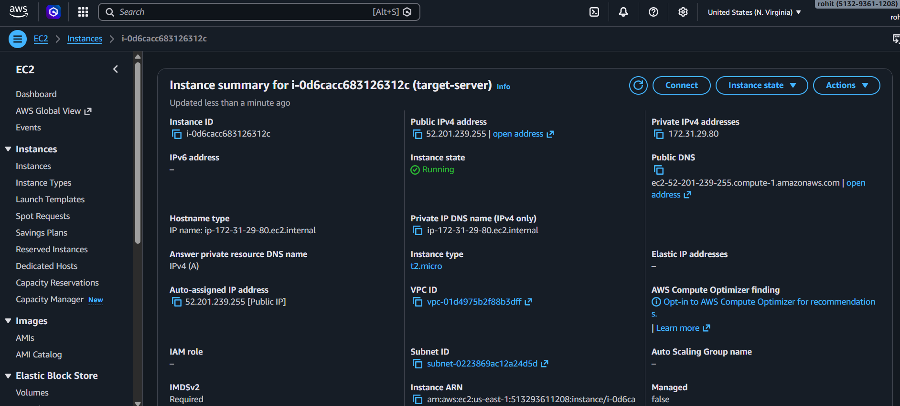
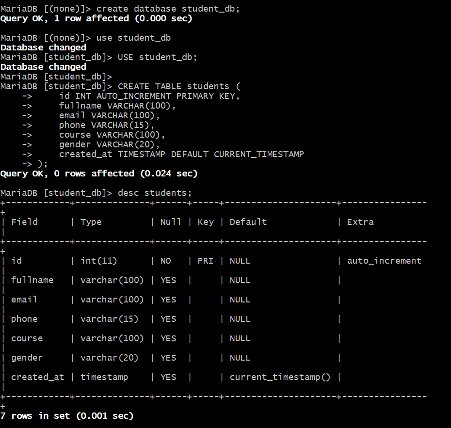
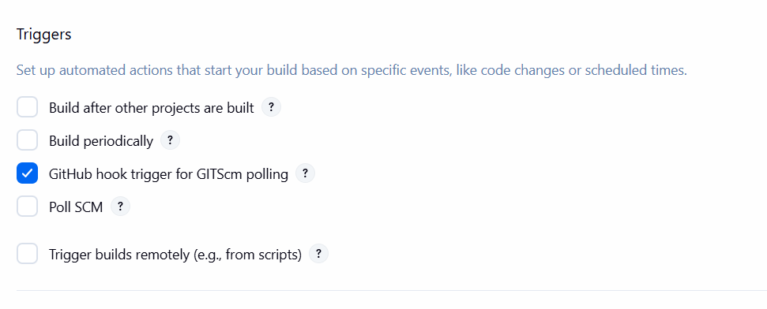
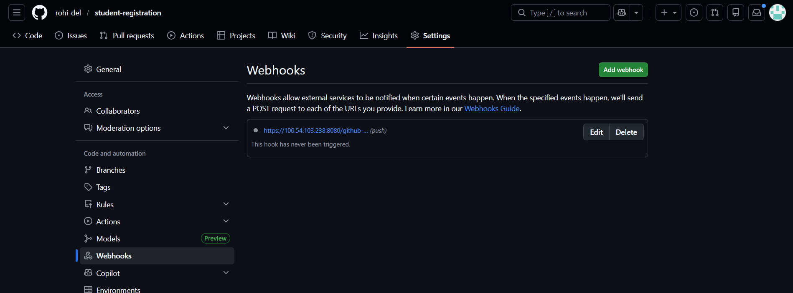
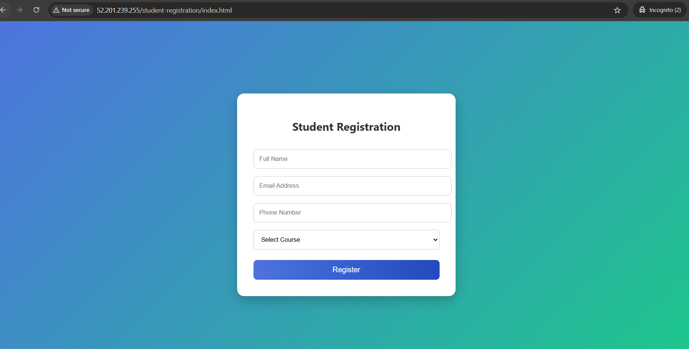
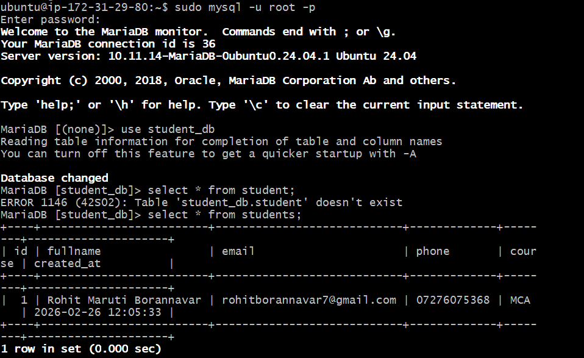
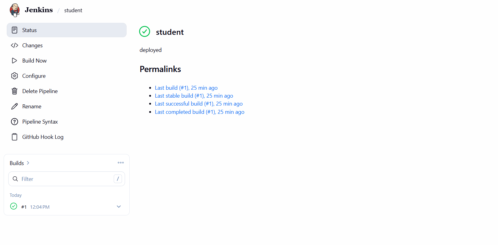

# 🚀 CI/CD Deployment of Dynamic Web Application using GitHub, Jenkins & AWS

## 📌 Project Overview
This project demonstrates end-to-end CI/CD automation of a dynamic PHP-based web application deployed on AWS EC2.

The workflow includes:
- Code written on Local Machine
- Pushed to GitHub repository
- GitHub Webhook triggers Jenkins
- Jenkins deploys application to Target EC2 instance via SSH
- Apache serves the application
- MariaDB stores application data

---

## 🏗 Architecture Flow

---

## ☁ AWS Infrastructure Setup

### 1️⃣ EC2 Instances
- Jenkins Master EC2 Instance
- Target Application EC2 Instance
- Security Groups configured:
  - Port 22 (SSH)
  - Port 80 (HTTP)

📸 Screenshot:

- jenkins-master instance

- jenkins-target instance

---

## 🗄 Database Setup

- Installed MariaDB on Target EC2
- Created Database: `student_db`
- Created Table: `students`
- Created dedicated DB user
- Granted required privileges

📸 Screenshot:
- Database setup

---

## ⚙ Jenkins CI/CD Setup

- Installed required plugins
- Added SSH credentials
- Created Pipeline Job
- Configured GitHub Webhook
- Added Jenkinsfile
- Automated deployment via SSH

📸 Screenshot:

- Attached webhook in jenkins job

- Webhook Setup

---

## 🔄 CI/CD Workflow Steps

1. Developer writes code on Local Machine
2. Pushes code to GitHub repository
3. GitHub triggers Jenkins using Webhook
4. Jenkins pulls latest code
5. Jenkins connects to Target EC2 via SSH
6. Application deployed to `/var/www/html/`
7. Apache restarts
8. Application goes live

---

## 🌐 Output

After successful deployment:

- Application accessible using Public IP of Target EC2
- Web form loads successfully
- User can submit details
- Data stored in MariaDB database
- Jenkins console shows **Build Success**

📸 Application Output Screenshot:

- user-interface page

- Data Stored Successfully

### 📸 Jenkins Build Success Screenshot:

---

## 🔐 Security Implementation

- SSH Key-based authentication
- Restricted Security Groups
- Dedicated Database User
- Disabled root remote login
- Proper Linux file permissions

---

## 🛠 Tech Stack

- AWS EC2
- Linux (Amazon Linux / Ubuntu)
- Apache
- PHP
- MariaDB
- Jenkins
- GitHub
- HTML, CSS
- Git

---
## 📈 Key Learning Outcomes

- Implemented CI/CD using Jenkins
- Integrated GitHub Webhook with Jenkins
- Automated deployment via SSH
- Configured LAMP stack
- Managed AWS EC2 infrastructure
- Deployed dynamic web application

---